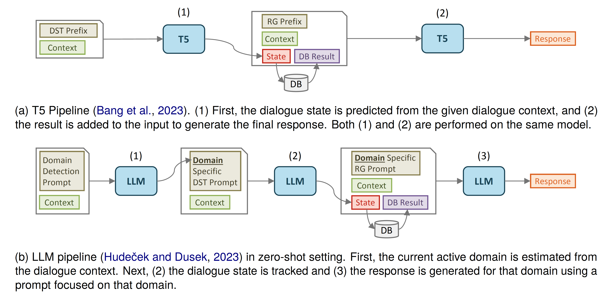
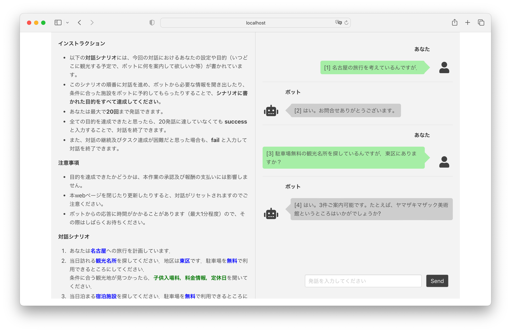

# JMultiWOZ: Japanese Multi-Domain Wizard-of-Oz Dataset
[](LICENSE)
[](https://huggingface.co/datasets/nu-dialogue/jmultiwoz)

This repo contains JMultiWOZ, a Japanese Multi-Domain Wizard-of-Oz Dataset, and code for benchmarking task-oriented dialogue models on the dataset. More details about the dataset can be found in our LREC-COLING 2024 paper:

**JMultiWOZ: A Large-Scale Japanese Multi-Domain Task-Oriented Dialogue Dataset** [[Paper](https://arxiv.org/abs/2403.17319)]

## Requirements
- Python 3.9+
```bash
pip install -r requirements.txt
```

## Dataset
Prepare the dataset by unzipping the dataset file `JMultiWOZ_1.0.zip` in the `dataset` directory:
```bash
cd dataset
unzip JMultiWOZ_1.0.zip
```
Detailed information about the dataset can be found in [dataset/README.md](dataset/README.md).

We also provide the dataset on [Hugging Face 🤗 Datasets Hub](https://huggingface.co/datasets/nu-dialogue/jmultiwoz). See the dataset card for more details.

## Dialogue Models
We provide the implementation of the following models as used in our paper:
| Model  | README link |Description   | 
| :---   | :---          | :---        |
| T5     |[tod_models/t5/README.md](tod_models/t5/README.md)| T5 model fine-tuned on JMultiWOZ |
| LLM    |[tod_models/llm/README.md](tod_models/llm/README.md)| Zero-shot and few-shot learning with OpenAI LLM API |

Note that to use the models with OpenAI API, you need to set an environment variable `OPENAI_API_KEY` before running the scripts as described in the following sections.



## Automatic Evaluation
### 1. Run inference to generate responses
Use `inference.py` to generate responses for the test set. Below is an example command using [LLM (OpenAI's `gpt-4`)](tod_models/llm/README.md) in a few-shot setting. See more options by running `python inference.py --help`.
> [!NOTE]
> Exact command we used can be found in `run_scripts/run_inference_*.sh`.

```bash
export OPENAI_API_KEY="<YOUR_API_KEY>"

python inference.py \
    --tod_model_type "openai-fs" \
    --model_name_or_path "gpt-4" \
    --max_output_length 256 \
    --output_dir "output/gpt4-fs-olen256" \
    --task_name "e2e" \
    --resume_last_run \
    --world_size 1
```
Generated dialogue states and responses will be saved in `output/gpt4-fs-olen256/e2e.inference.json`.


### 2. Evaluate the generated responses
Use `evaluate.py` to evaluate the generated responses. Below is an example command evaluating the output of the above inference. See more options by running `python evaluate.py --help`.
> [!NOTE]
> Exact command we used can be found in `run_scripts/run_evaluate.sh`.

```bash
python evaluate.py \
    --dataset_dpath "dataset/JMultiWOZ_1.0" \
    --inference_output_dpath "output/gpt4-fs-olen256" \
    --task_name "e2e"
```
Resulted scores will be saved in `output/gpt4-fs-olen256/e2e.scores_summary.json`.

### End-to-End generation results reported in our paper
| Model             | JGA   | Slot F1   | BLEU  |
| :---              | :---: | :---:     | :---: |
| T5-base           | 0.59  | 0.95      | 39.7  |
| T5-large          | 0.77  | 0.98      | 46.4  |
| GPT-3.5 zero-shot | 0.16  | 0.70      | 5.40  |
| GPT-3.5 few-shot  | 0.25  | 0.82      | 12.18 |
| GPT-4 zero-shot   | 0.31  | 0.86      | 8.72  |
| GPT-4 few-shot    | 0.36  | 0.89      | 14.94 |

## Human Evaluation
We provide a web UI for human evaluation. The web UI allows you to interact with the models and judge the dialogue quality.



### 1. Run evaluation web UI
```bash
export OPENAI_API_KEY="<YOUR_API_KEY>" # Required if you use models with OpenAI API

python human_eval.py \
    --tod_model_names gpt4-fs gpt3.5-fs \
    --threading_httpd
```
To interact with specific models and user goals setting, you can use `--task_ids_fpath` option, which is a path to a JSON file containing a list of task IDs. See `task_ids.json` for example.

### 2. Open the web page in your browser
- For local access: http://localhost:8080/dialogue
- For remote access: http://your-server-ip/dialogue

If you use `--task_ids_fpath` option, you can specify the task ID by adding `?task_id=<task_id>` to the URL (e.g., http://localhost:8080/dialogue?task_id=task_B).

### Results reported in our paper
| Model             | # Participants    | Success   | Turn  | Satisfaction  |
| :---              | :---:             | :---:     | :---: | :---:         |
| T5-base           | 38                | 55.26     | 11.21 | 3.05          |
| T5-large          | 40                | 65.00     | 10.93 | 3.55          |
| GPT-3.5 few-shot  | 41                | 24.39     | 10.37 | 2.15          |
| GPT-4 few-shot    | 42                | 57.14     | 9.64  | 3.33          |

## Citation
```bibtex
@inproceedings{ohashi-lrec2024-jmultiwoz,
    title = "JMultiWOZ: A Large-Scale Japanese Multi-Domain Task-Oriented Dialogue Dataset",
    author = "Ohashi, Atsumoto and Hirai, Ryu and Iizuka, Shinya and Higashinaka, Ryuichiro",
    booktitle = "Proceedings of the 2024 Joint International Conference on Computational Linguistics, Language Resources and Evaluation",
    year = "2024",
    url = "",
    pages = "",
}

@inproceedings{ohashi-nlp2023-jmultiwoz,
    title = "JMultiWOZ: 日本語タスク指向型対話データセットの構築",
    author = "大橋, 厚元 and 平井, 龍 and 飯塚, 慎也 and 東中, 竜一郎",
    booktitle = "言語処理学会第29回年次大会 ",
    year = "2023",
    url = "https://www.anlp.jp/proceedings/annual_meeting/2023/pdf_dir/Q12-1.pdf",
    pages = "3093--3098",
}

@inproceedings{ohashi-nlp2024-jmultiwoz,
    title = "JMultiWOZ に対する対話状態アノテーションの付与と対話システムの実装評価",
    author = "大橋, 厚元 and 平井, 龍 and 飯塚, 慎也 and 東中, 竜一郎",
    booktitle = "言語処理学会第30回年次大会 ",
    year = "2024",
    url = "https://www.anlp.jp/proceedings/annual_meeting/2024/pdf_dir/B10-5.pdf",
    pages = "2744--2749",
}
```

## Aknowledgement
This work was supported by JST Moonshot R&D Grant number JPMJMS2011.


## License
The JMultiWOZ dataset is licensed under a [Creative Commons Attribution-ShareAlike 4.0 International License][cc-by-sa]. Models trained using the dataset are not considered copies or direct derivatives of the dataset itself, and thus are not required to comply with the terms of this license.

[![CC BY-SA 4.0][cc-by-sa-image]][cc-by-sa]

[cc-by-sa]: http://creativecommons.org/licenses/by-sa/4.0/
[cc-by-sa-image]: https://licensebuttons.net/l/by-sa/4.0/88x31.png
[cc-by-sa-shield]: https://img.shields.io/badge/License-CC%20BY--sa%204.0-lightgrey.svg
